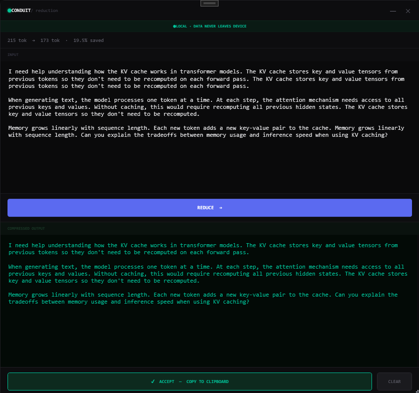
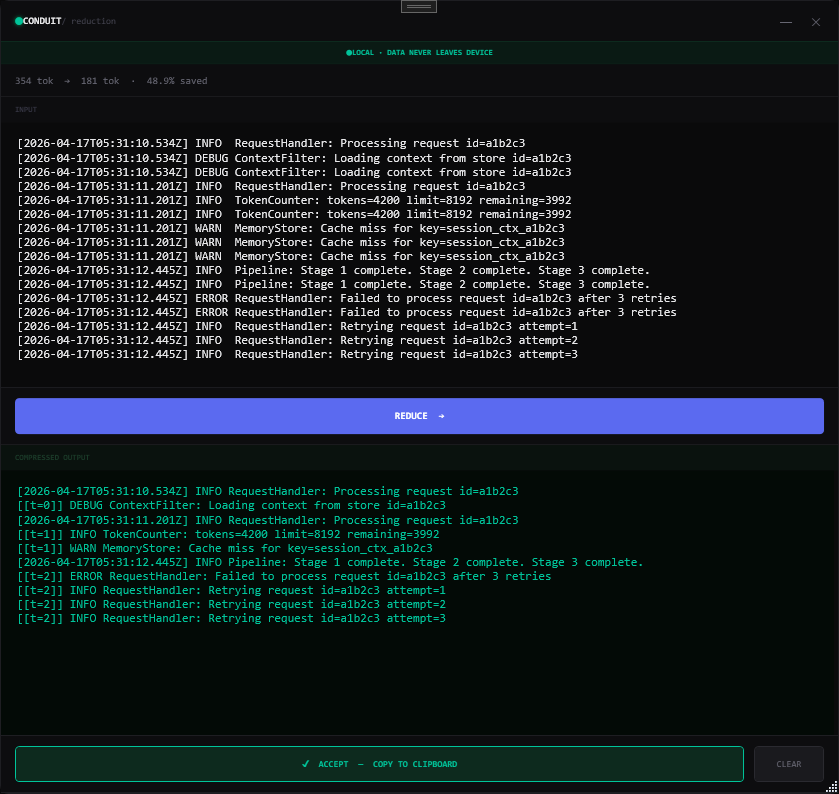
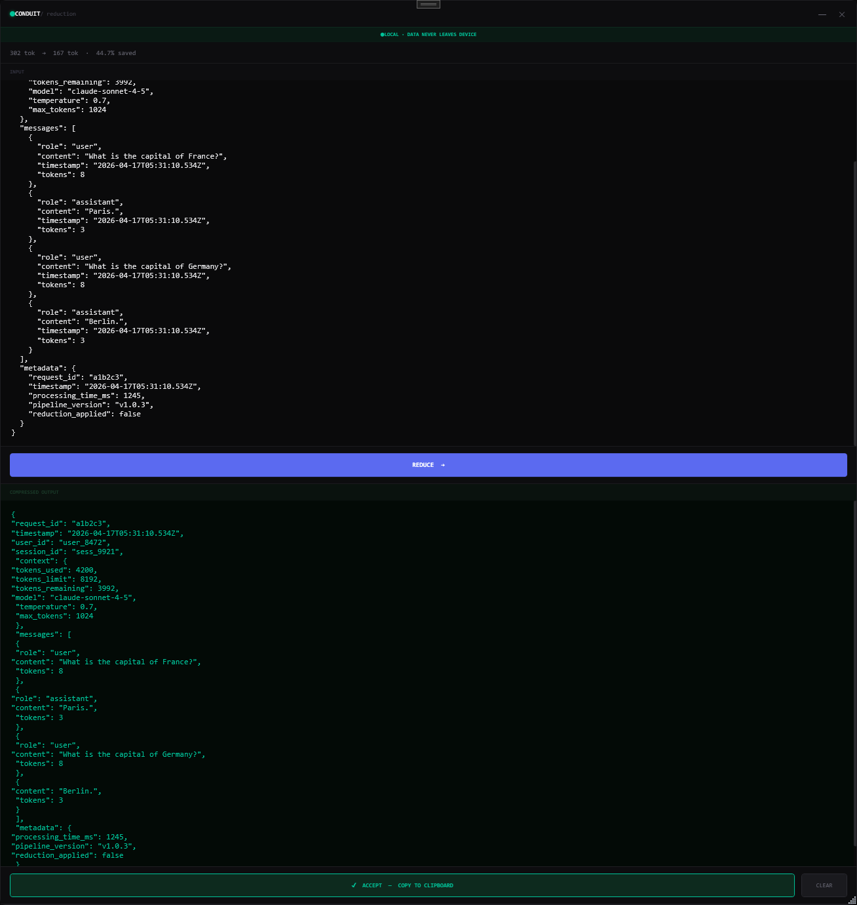
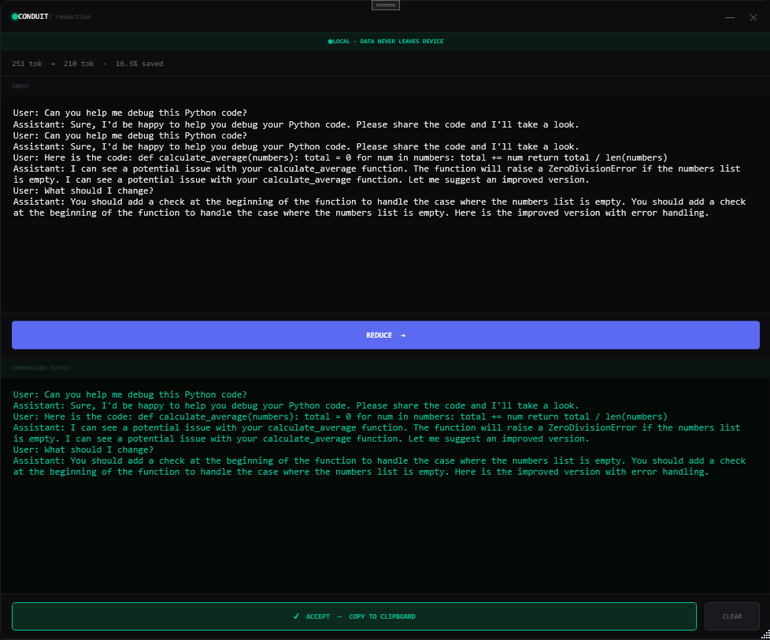
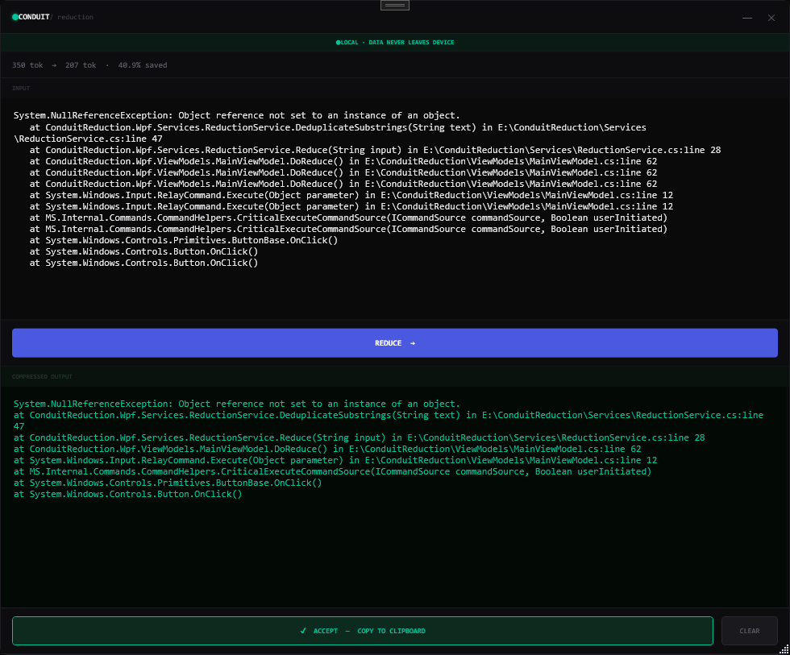
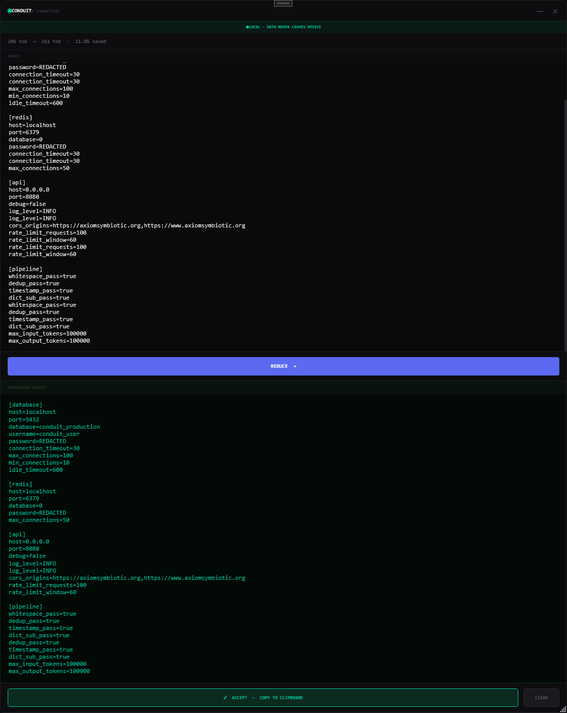
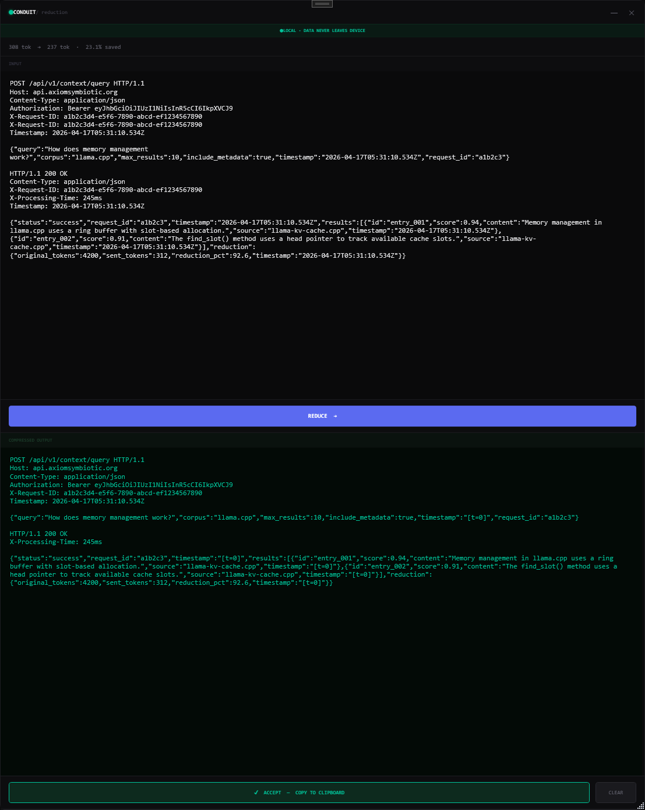
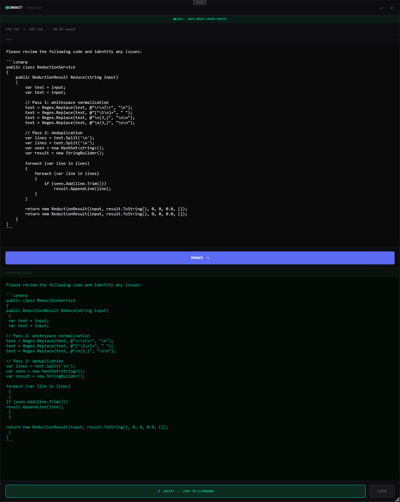

# Conduit-Reduction

A free desktop widget that reduces the token count of any text before you paste it into a chat app. Works with Claude, ChatGPT, Gemini, anything — no account, no install hooks, no data leaves your machine.

> While this is a much more limited version of our full capability, we thought it was still useful. Enjoy.

---

## What it does

Paste a prompt. Click **Reduce**. Copy the result. Paste into your chat app of choice.

Four deterministic passes run locally:

1. **Whitespace normalization** — collapses redundant spacing
2. **Sentence-level deduplication** — drops exact repeats from long paragraphs
3. **Timestamp encoding** — replaces repeated ISO timestamps with short references (`[t=0]`, `[t=1]`…)
4. **Dictionary substitution** — replaces frequent 7+ character words with single-char symbols when the math works out

Timestamp and dictionary encoding are reversible. Whitespace normalization and exact-duplicate removal intentionally discard formatting and redundant repeats. Nothing is summarized, approximated, or paraphrased by another model.

---

## How it reduces

Reductions range from **~15% on conversational prose** to **~49% on structured data**. The more structure, the better it works. Eight real runs on the demo build:

### Repetitive explanation — 19.5% saved
Sentence-level dedup catches the duplicated clause about the KV cache.

### Server logs — 48.9% saved
Timestamp encoding (`[[t=0]]`, `[[t=1]]`, `[[t=2]]`) collapses repeated ISO timestamps; sentence dedup catches identical log lines.

### JSON payload — 44.7% saved
Whitespace normalization flattens indentation; timestamps and repeated keys reduce further.

### Chat transcript — 16.3% saved
Conversational prose gives the least back — each sentence differs enough to survive dedup. This is the honest floor.

### Stack trace — 40.9% saved
Repeated path fragments and method names compress well.

### Config file — 21.8% saved
Catches literal line duplicates; short structural lines (`[section]`, key-value pairs) stay intact.

### HTTP request/response — 23.1% saved
Timestamps encode; headers stay readable.

### Code with duplicates — 40.6% saved
Catches duplicate lines and redundant statements without touching the structural braces.

---

## Privacy

- **Local only.** Everything runs on your machine. The classification banner at the top of the widget always reads `DATA NEVER LEAVES DEVICE`.
- **No telemetry.** No analytics, no crash reports, no "anonymous usage data."
- **No account.** Download, run, done.

---

## What this is not

- Not semantic compression
- Not lossy summarization
- Not an AI wrapper that calls another model
- Not a browser extension (those get blocked by service workers on most chat sites)

It's a structural pre-processor. Byte-level, regex-level, deterministic. If you run the same input twice you get the same output twice.

---

## When it won't help

- Short prompts (under a few hundred tokens) — the overhead of the key table sometimes exceeds the savings
- Truly random or already-compressed data
- Content with no repetition or structure

The widget will still produce output, it just might save very little. The token counter shows you the real number every time.

---

## The full Conduit

This widget is a deliberately limited slice of the full Conduit product — which adds corpus-indexed retrieval, memory management, PII stripping, provider routing, and a full desktop chat interface built around a trust-mediated buffer layer.

Early access: **[axiomsymbiotic.org](https://axiomsymbiotic.org)**

Developers looking for a drop-in Python middleware (same reduction algorithm, wrap your API calls): **[Conduit-Open](https://github.com/Axiom-Symbiotic/conduit-open)**.

---

## License

MIT. Fork it, extend it, ship it.

---

Built by [Axiom Symbiotic](https://axiomsymbiotic.org).

Logo drawn by W.
